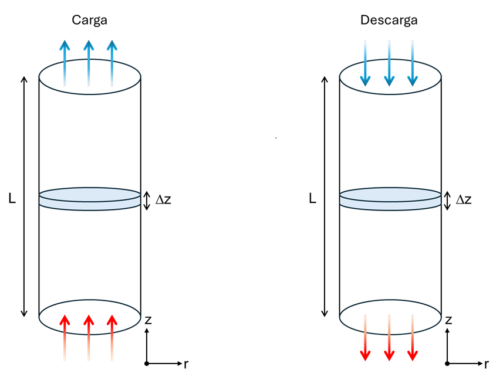

# Contexto y Relevancia
En el escenario actual de alta penetración de energías renovables con carga variable, toma relevancia el almacenamiento térmico (TES) como una solución a problemas como pueden ser el aprovechamiento del vertimiento de energía, en cuanto a esto en Chile el 2024 cerró con más de 6 TWh de energía renovable reducida, es decir energía limpia generada pero no aprovechada, lo que exige sistemas de respaldo térmico flexibles para mantener la continuidad del servicio. (Djunisic, 2025).

También tiene relevancia la oportunidad de sustituir fuentes de generación mediante combustibles fósiles en procesos de alta demanda de energía térmica a partir del uso de sistemas TES, reduciendo las emisiones cuando estos son cargados mediante energías renovables. O a su vez mediante el aprovechamiento de calor residual, se señala que cerca del 60% de la generación de calor industrial es perdido como calor residual, y que su utilización podría reducir el uso de combustibles fósiles así como aportar a la carbono neutralidad (Sun et al., 2023).

# Figura
el modelamiento consiste en el calentamiento del lecho solido mediante aire en la carga y calentamiento del aire mediante el lecho en la descarga.

# Modelo Matematico 
Se implemento un modelo 0D, descrito en el codigo. A continuacion se describe el modelo principal aportado, el modelo para la carga y descarga de almacenamiento termico de un lecho solido mediante aire como fluido de transferencia de calor. Este fue desarrollado a partir del trabajo presentado por (Moradi et al., 2022). Tambien se utilizo para la obtencion de correlacion empiricas (coeficiente de transferencia de calor) y parametros del relleno (densidad, capacidad calorifica, etc.), el trabajo realizado por (Jurczyk et al., 2024).

###  Charge process 
Air:

$$
\frac{dT_g}{dt} = -\frac{\dot{m_g}}{\rho_g A\epsilon}\frac{dT_g}{dz} -\frac{ha}{\rho_g C_{p_{g}}\epsilon}(T_g-T_p)
$$

Packed Bed:

$$
\frac{dT_p}{dt} = \frac{ha}{\rho_p C_{p_{p}}(1-\epsilon)}(T_g-T_p)
$$

#### Initial Conditions t=0

$$
T_g = T_{p_{in}}
$$

$$
T_p = T_{p_{in}}
$$

#### Boundary conditions

$$
T_{g}(0,t) = T_{g_{in}}
$$

### Discharge process

Air:

$$
\frac{dT_g}{dt} = \frac{\dot{m_g}}{\rho_g A\epsilon}\frac{dT_g}{dz} +\frac{ha}{\rho_g C_{p_{g}}\epsilon}(T_p-T_g)
$$

Packed Bed:

$$
\frac{dT_p}{dt} = -\frac{ha}{\rho_p C_{p_{p}}(1-\epsilon)}(T_p-T_g)
$$

#### Initial Conditions t=0
$$
T_{g}(z,0) = T_{g_{des}}
$$

$$
T_{p}(z,0) = T_{p_{carga}}
$$

#### Boundary conditions
$$
T_{g}(L,t) = T_{g_{des}}
$$

# Metodo Numerico
La elección del método de líneas (MOL) como estrategia numérica para resolver el modelo de transferencia de calor en el lecho empacado se fundamenta en la estructura matemática del problema. El sistema está gobernado por ecuaciones diferenciales parciales (EDP) de tipo convección–transferencia de calor y el acoplamiento principal ocurre en el dominio temporal debido al intercambio energético entre el fluido y el sólido.

El MOL permite transformar las derivadas espaciales en un conjunto de ecuaciones diferenciales ordinarias (EDO) mediante una discretización en el eje z. De esta forma, la dinámica en el tiempo puede resolverse con integradores robustos para EDO.

### discretization Charging Process

El aire avanza desde z=0 a z=L, por lo que la informacion se transporta hacia indices mayores. Considerando esto, se utiliza el esquema backward para mayor estabilidad numerica:

$$
\frac{dT_g}{dz} = \frac{T_{g_{i}}-T_{g_{i-1}}}{\Delta z}
$$

Air:

$$
\frac{dT_{g_i}}{dt} = -\frac{\dot{m_g}}{\rho_g A\epsilon}\frac{T_{g_{i}}-T_{g_{i-1}}}{\Delta z} -\frac{ha}{\rho_g C_{p_{g}}\epsilon}(T_{g_i}-T_p)
$$

$$
\frac{dT_{g_i}}{dt} = \frac{\dot{m_g}}{\rho_g A\epsilon \Delta z}T_{g_{i-1}}-\left(\frac{ha}{\rho_g C_{p_{g}}\epsilon}+\frac{\dot{m_g}}{\rho_g A\epsilon \Delta z}\right) T_{g_i} +  \frac{ha}{\rho_g C_{p_{g}}\epsilon} T_p
$$

Packed Bed:

$$
\frac{dT_{p_i}}{dt} = \frac{ha}{\rho_p C_{p_{p}}(1-\epsilon)}(T_{g_i}-T_{p_i})
$$

$$
\frac{dT_{p_i}}{dt} = - \frac{ha}{\rho_p C_{p_{p}}(1-\epsilon)} T_{p_i} + \frac{ha}{\rho_p C_{p_{p}}(1-\epsilon)} T_{g_i} 
$$

### Discretization

El aire avanza desde z=L a z=0, por lo que la informacion se transporta hacia indices menores. Considerando esto, se utiliza el esquema forward para mayor estabilidad numerica:

$$
\frac{dT_g}{dz} = \frac{T_{g_{i+1}}-T_{g_{i}}}{\Delta z}
$$

Air:

$$
\frac{dT_{g_i}}{dt} = \frac{\dot{m_g}}{\rho_g A\epsilon}\frac{T_{g_{i+1}}-T_{g_{i}}}{\Delta z} +\frac{ha}{\rho_g C_{p_{g}}\epsilon}(T_p-T_{g_i})
$$

$$
\frac{dT_{g_i}}{dt} = \frac{\dot{m_g}}{\rho_g A\epsilon \Delta z}T_{g_{i-1}}-\left(\frac{ha}{\rho_g C_{p_{g}}\epsilon}+\frac{\dot{m_g}}{\rho_g A\epsilon \Delta z}\right) T_{g_i} +  \frac{ha}{\rho_g C_{p_{g}}\epsilon} T_p
$$

Packed Bed:

$$
\frac{dT_{p_i}}{dt} = -\frac{ha}{\rho_p C_{p_{p}}(1-\epsilon)}(T_{p_i}-T_{g_i})
$$

$$
\frac{dT_{p_i}}{dt} = - \frac{ha}{\rho_p C_{p_{p}}(1-\epsilon)} T_{p_i} + \frac{ha}{\rho_p C_{p_{p}}(1-\epsilon)} T_{g_i} 
$$

# Resultados y Aporte

Los principales resultados obtenidos a partir del modelo numérico permiten caracterizar el comportamiento térmico del sistema de almacenamiento en lecho empacado durante los procesos de carga y descarga. Entre los aportes más relevantes se encuentran:

#### Temperatura del aire a la salida del lecho
El modelo entrega la temperatura del aire para carga y descarga, lo que permite determinar la capacidad útil del TES, el tiempo durante el cual el sistema puede entregar aire por sobre una temperatura mínima requerida, y evaluar si el almacenamiento es capaz de cumplir con las condiciones térmicas del proceso posterior (por ejemplo, calentamiento de agua o generación de vapor).

#### Perfiles de temperatura a lo largo del lecho
Los perfiles de temperatura para el aire y el lecho permiten identificar la evolución del frente térmico, evaluar la estratificación del lecho y determinar qué fracción del material participa activamente del almacenamiento. Esto permite estimar cuánta energía queda realmente disponible y evaluar si el volumen del lecho está subdimensionado o sobredimensionado.

#### Determinación del tiempo de carga y descarga efectiva
A partir de la evolución temporal de la temperatura de salida y del perfil a lo largo del lecho, se puede establecer el tiempo durante el cual la energía entregada es térmicamente útil. Facilitando la toma de decisiones operativas. 

# Referencias
Djunisic, S. (2025). Chile’s renewable energy curtailments up 17% y/y in H1 2025. https://renewablesnow.com/news/chiles-renewable-energy-curtailments-up-17-percent-yy-in-h1-2025-1280137/

Moradi, M., Farrokhi, M., Rahimi, A., & Hatamipour, M. S. (2022). Modeling strategies for sensible heat thermal energy recovery through packed beds. Journal of Energy Storage, 54, 105297. https://doi.org/10.1016/j.est.2022.105297

Jurczyk, M., Spietz, T., Czardybon, A., Dobras, S., Ignasiak, K., Bartela, Ł., Uchman, W., & Ochmann, J. (2024). Review of Thermal Energy Storage Materials for Application in Large-Scale Integrated Energy Systems—Methodology for Matching Heat Storage Solutions for Given Applications. Energies, 17(14).

Sun, M., Liu, T., Wang, X., Liu, T., Li, M., Chen, G., & Jiang, D. (2023). Roles of thermal energy storage technology for carbon neutrality. Carbon Neutrality, 2(1), 12. https://doi.org/10.1007/s43979-023-00052-w 

